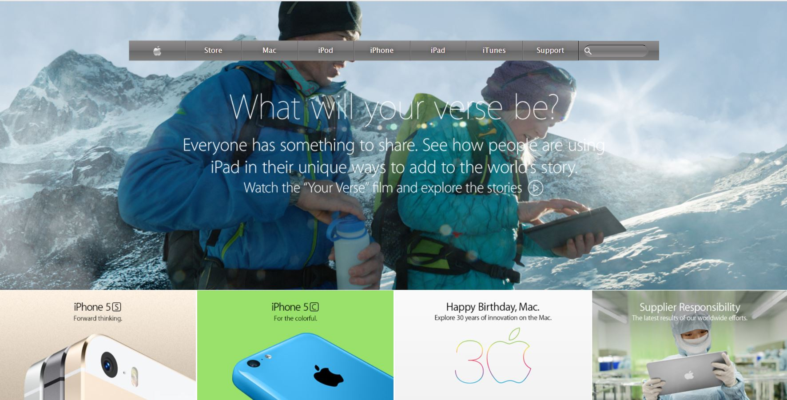

# Apple-Website
This project's purpose is to recreate apple's website

This project is made to test our understanding in background and gradients.

## Built With

- HTML5, CSS3
- No frameworks are used in this project

## Live Demo

[Live Demo Link](https://rawcdn.githack.com/SunnySparks/Apple-Website/8923e8c48d20bd8be7b2f3d15c11dfca98c49f36/index.html)

## Authors

👤 **Bereket Beshane**

- Github: [@berabjesus](https://github.com/Berabjesus)
- Twitter: [@bereket_ababu_b](https://twitter.com/bereket_ababu_b)
- Linkedin: [linkedin](https://www.linkedin.com/in/bereket-beshane-a1b75a1a9/)

👤 **José Francisco Silva Díaz**

- Github: [@SunnySparks](https://github.com/sunnySparks)
- Twitter: [@JosFranT6](https://twitter.com/josfrant6)
- Linkedin: [linkedin](https://www.linkedin.com/in/josé-francisco-silva-díaz-a2a9421a6)

## 🤝 Contributing

Contributions, issues, any kind of feedback and feature requests are welcome!

## Show your support

Give a ⭐️ if you like this project!

## Acknowledgments

- On this website we worked on giving backgrounds to containers.

## 📝 License

This project has no license
